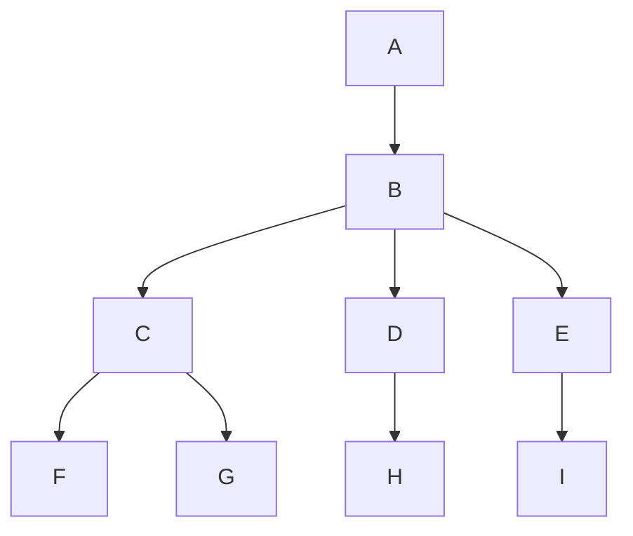

# closure2wbs

closure2wbs is a cli tool for converting a list of closure tables to a WBS structure for PlantUML or Mermaid.
Currently, the tool assumes a JSON file input, and outputs to file.

> [!WARNING]
> This cli tool is not thoroughly tested! 

## Installation
Assuming you have `cargo` setup:

```sh
cargo install --git https://github.com/stefafafan/closure2wbs
```

## Usage
Try `--help`

```sh
$ closurewbs --help

A cli tool to convert closure tables to a WBS representation.

Usage: closure2wbs [OPTIONS]

Options:
  -f, --format <FORMAT>  [default: plantuml]
  -i, --input <INPUT>    [default: input.json]
  -o, --output <OUTPUT>  [default: output.txt]
  -h, --help             Print help
  -V, --version          Print version
  ```

### Example

Prepare a json file like following:

```json
[
	{
		"ancestor": "A",
		"descendant": "A"
	},
	{
		"ancestor": "A",
		"descendant": "B"
	},
	{
		"ancestor": "B",
		"descendant": "B"
	},
	{
		"ancestor": "B",
		"descendant": "C"
	},
	{
		"ancestor": "B",
		"descendant": "D"
	},
	{
		"ancestor": "B",
		"descendant": "E"
	},
	{
		"ancestor": "C",
		"descendant": "C"
	},
	{
		"ancestor": "C",
		"descendant": "F"
	},
	{
		"ancestor": "C",
		"descendant": "G"
	},
	{
		"ancestor": "D",
		"descendant": "D"
	},
	{
		"ancestor": "D",
		"descendant": "H"
	},
	{
		"ancestor": "E",
		"descendant": "E"
	},
	{
		"ancestor": "E",
		"descendant": "I"
	}
]
```

Run the cli tool.

```sh
closure2wbs --input input.json --output out.puml --format plantuml
```

`out.puml` contents will be like as the following.

```pml
@startwbs
* A
** B
*** C
**** F
**** G
*** D
**** H
*** E
**** I
@endwbs
```

Mermaid output is supported as well:

```sh
closure2wbs --input input.json --output out.mmd --format mermaid
```


